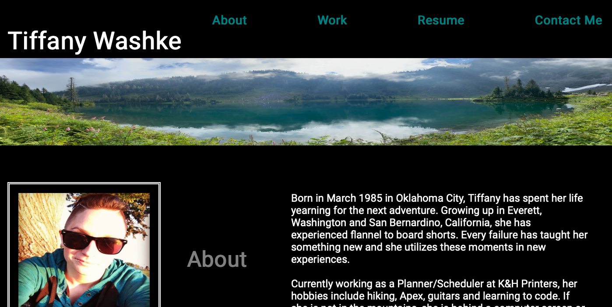
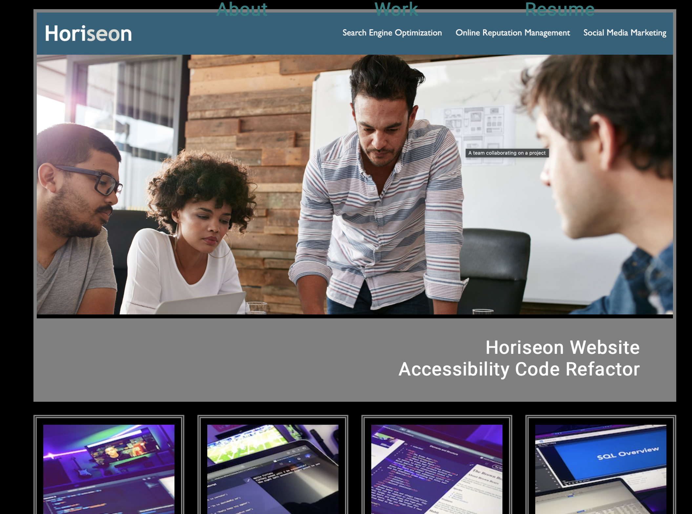
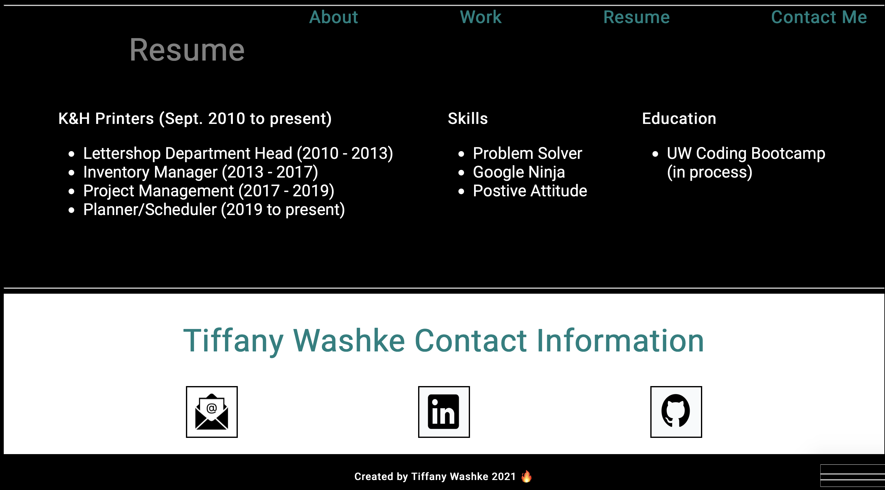

# Tiffany-Washke-Portfolio

## Project Description

A portfolio website for and about Tiffany Washke utilizing HTML and CSS. 

## Table of Contents 

- [About the Project](#about-the-project)
- [Installation](#installation)
- [Usage](#usage)
- [Credit](#credit)
- [License](#license)

## About the Project

- This project was built to be able to showcase Tiffany Washke's future projects online.
- The motiviation for this project was to utilize the HTML and CSS skills learned.
- Navigation links have been added to browse the portfolio sections easier.
- Comments have been added to both the HTML and CSS files to communicate elements and selectors.
- Media queries have been added to allow the viewer to see the website on multiple different devices.

## Installation

- Open [Tiffany Washke Portfolio](https://twashke.github.io/Tiffany-Washke-Portfolio/) 
- Or, open index.html in your internet browser.

## Usage

- Scroll or use the navigation links provided to see the four different sections.

 \
\
 \
\
 

## Credit

- Flexbox Froggy for help understanding flexbox containers.
- Flexbox Zombie for help understanding flexbox containers.

## License

- No License, created by Tiffany Washke 2021.