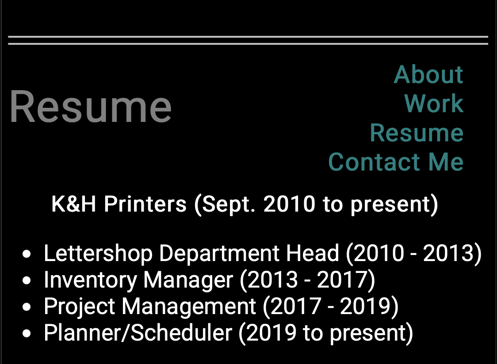

# Tiffany-Washke-Portfolio

## Project Description

A portfolio website about Tiffany Washke utilizing HTML and CSS. 

## Table of Contents 

- [About the Project](#about-the-project)
- [Installation](#installation)
- [Usage](#usage)
- [Credit](#credit)
- [License](#license)

## About the Project

- This project was built to be able to showcase Tiffany Washke's future projects online.
- The motiviation for this project was to utilize the HTML and CSS skills learned.
- Navigation links have been added to browse the portfolio sections easier.
- Comments have been added to both the HTML and CSS files to communicate elements and selectors.
- Media queries have been added to allow the viewer to see the website on multiple different devices.

## Installation

- Open [Tiffany Washke Portfolio](https://twashke.github.io/Tiffany-Washke-Portfolio/) 
- Or, open index.html in your internet browser.

## Usage

- Scroll or use the navigation links provided to see the four different sections.

About Section \
 \
\
Work Section \
 \
\
Resume and Contact Section \
 \
\
Resume Section Reduced for Small Screens \

## Credit

- Flexbox Froggy for help understanding flexbox containers.
- Flexbox Zombie for help understanding flexbox containers.

## License

The MIT License (MIT)

Copyright (c) 2015 Chris Kibble

Permission is hereby granted, free of charge, to any person obtaining a copy of this software and associated documentation files (the "Software"), to deal in the Software without restriction, including without limitation the rights to use, copy, modify, merge, publish, distribute, sublicense, and/or sell copies of the Software, and to permit persons to whom the Software is furnished to do so, subject to the following conditions:

The above copyright notice and this permission notice shall be included in all copies or substantial portions of the Software.

THE SOFTWARE IS PROVIDED "AS IS", WITHOUT WARRANTY OF ANY KIND, EXPRESS OR IMPLIED, INCLUDING BUT NOT LIMITED TO THE WARRANTIES OF MERCHANTABILITY, FITNESS FOR A PARTICULAR PURPOSE AND NONINFRINGEMENT. IN NO EVENT SHALL THE AUTHORS OR COPYRIGHT HOLDERS BE LIABLE FOR ANY CLAIM, DAMAGES OR OTHER LIABILITY, WHETHER IN AN ACTION OF CONTRACT, TORT OR OTHERWISE, ARISING FROM, OUT OF OR IN CONNECTION WITH THE SOFTWARE OR THE USE OR OTHER DEALINGS IN THE SOFTWARE.